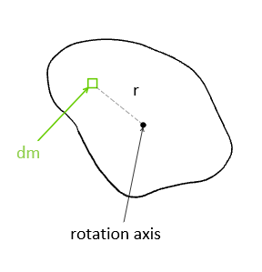
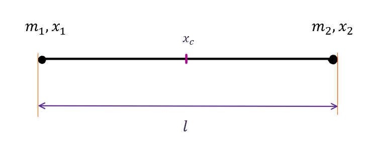
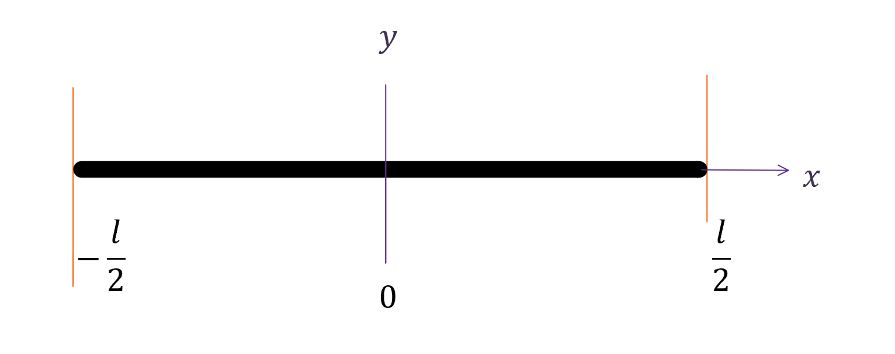
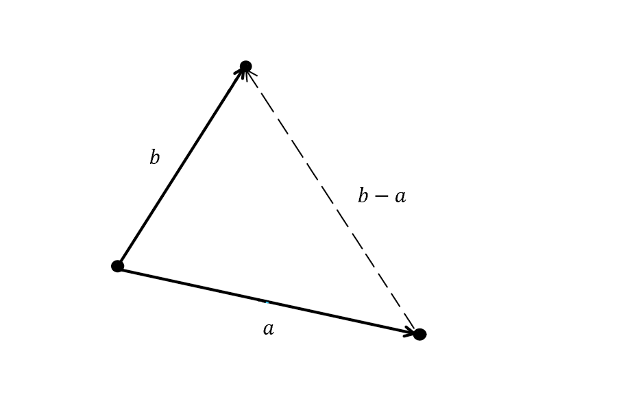
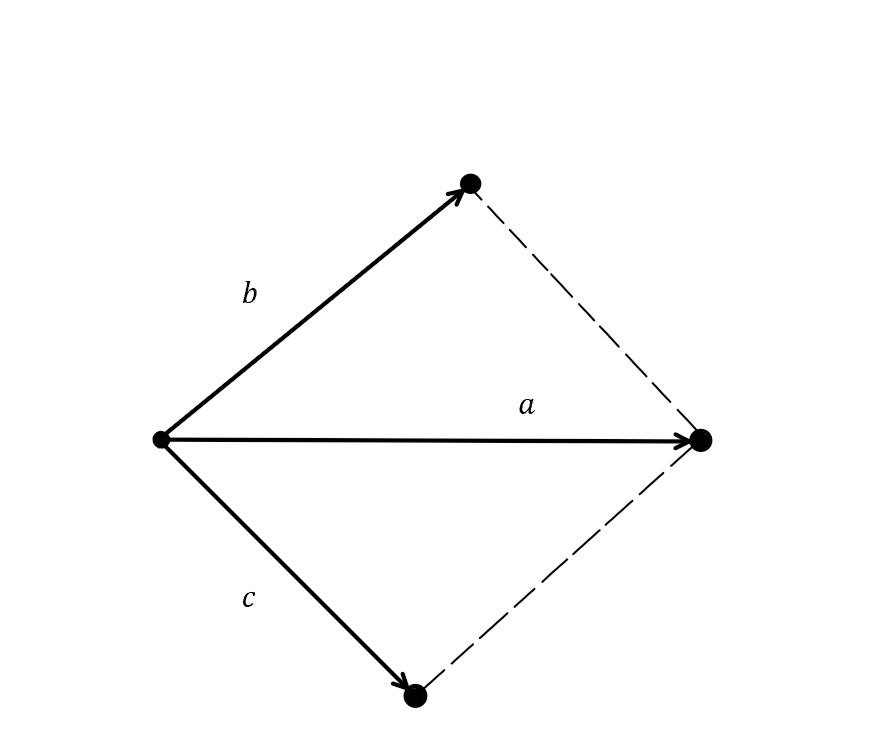

--- 
"layout": "page",
"lang": "En",
"title": "Studienarbeit",
"date": "Sept 2020",
"description": "Mein Bericht",
"tags": ["microjam","mec-2","Studienarbeit"," "],
"math": true
 ---
  
  
  # **Center of Mass and Mass Moment of Inertia of Particles (Polygonal)**

Sarah Sabrina Binti Shaharudin  
*University of Applied Sciences, Dortmund, Germany*  
June 2020 

## **Abstract**
---

In this research project, we will conduct a theory, in which mass moment of inertia of identical point masses is equal to the moment of inertia of its corresponding shape (in this case simple polygons). The centroid of the point masses is a point that corresponds to the center of gravity of a very thin homogeneous plate of the same area and shape. When the sum of $n$ point masses, $m_a$ including the concentrated mass at its center, $m_c$ is equal to the mass $M$ of the corresponding object, we are able to determine and see the trend of mass distribution of these point masses in a system of particles.

Mathematically, it can be written as
$$ \sum M_{Particles} = n \cdot m_{a} + m_{c} = M $$ (1.1)
<!-- 
 (1.1) 
  -->

## **1. Introduction**
----
 ### **1.1 Center of Mass**
The *center of mass* is the unique point at the center of a distribution of mass in space that has the property that the weighted position vectors relative to this point sum to zero. Simply saying, it is the average position of all the parts of the system. For simple rigid objects with uniform density, the center of mass, $r_c$ is located at the *centroid*. Informally, it is the point at which a cutout of the shape could be perfectly balanced on the tip of a pin.

A weighted position vector, $r$ is a vector which points from the origin to an object and has magnitude $m$, where $m$ is the mass of the object. For a system of $n$ objects, the center of mass is the point where 

$$ \sum_{i = 1}^{n} m_{i} \cdot r_{i} = 0 $$ 

where $m_i$ are the point masses in a system of particles with coordinates $r_i$. 

The sum of vectors for the total mass will point us to the center of mass. Mathematically, it is given as

$$ r_{c} = \frac{\sum_{i = 1}^{n} m_{i} \cdot r_{i}}{\sum_{i = 1}^{n} m_{i}} $$ (1.2)

### **1.2 Mass Moment of Inertia**

The *mass moment of inertia* measures the extent to which an object resists rotational acceleration about an axis, and is the rotational analogue to mass. The larger the mass moment of inertia, the smaller the angular acceleration about that axis for a given torque.

For a point mass, the mass moment of inertia may be generally expressed as the mass $m$ times the square of the perpendicular distance to the axis of rotation $r^2$.

$$ J = mr^2 $$

The moment of inertia of a composite rigid object is the sum of the moments of inertia of its component subsystems (all taken about the same axis) as follows

$$ J = \sum_{i = 1}^{n} m_{i} r_{i}^2 $$ (1.3)

Therefore, the moment of inertia is a physical property that combines the mass and distribution of the particles around the rotation axis. Notice that rotation about different axes of the same body yield different moments of inertia.

A continuous mass system can be thought of as a collection of infinite mass particles. Thus, the moment of inertia of a distributed mass system can be written as

$$ J = \int_{0}^{M} r^2 \mathrm{d}m $$ (1.4)

where $r$ is the vector perpendicular to the axis of rotation and extending from a point on the rotation axis to a point of the mass element $\mathrm{d}m$.

<figure>
  
  <figcaption>Fig. 1: Moment of Inertia</figcaption>
</figure>

<!-- : style="text-align: center;" -->
<!-- 
  
 -->
<!-- 
 Fig. 1: Moment of Inertia 
 -->

Usually, the mass element $\mathrm{d} m$ will be expressed in terms of the geometry of the object, so that the integration can be carried out over the object as a whole (for example, over a long uniform rod).

## **2. Straight Line**
----

We will start this case study using two point masses, which then be correlated with a slender, uniform rod of the same length. The rod has a mass of $M$ which is equally distributed across the rod. The two point masses are of equal mass $m_a$.

### **2.1 Centroid of 2 Point Masses**

<figure>
  
  <figcaption>Fig. 2: Two Point Masses</figcaption>
</figure>

For two point masses, the position vectors are located along the $x$-axis. Here, we take $x_1$ as the reference point for all position vectors. Using the equation from [(1.2)](#1.1-Center-Of-Mass) the position of the center of mass is given by a position vector

$$
\begin{aligned}
 x_c &= \frac{\sum_{i = 1}^{n} m_{i} \cdot x_{i}}{\sum_{i = 1}^{n} m_{i}} \\
&= \frac{m_{1} \cdot 0 + m_{2} \cdot l}{m_{1} + m_{2}}  
\end{aligned}
$$

As stated before, the point masses have the same mass, $m_{a}$:

$$ m_{1} = m_{2} = m_{a} $$

Thus, we have

$$ x_c = \frac {1}{2}l $$

### **2.2 Mass Moment of Inertia of 2 Point Masses**

To find the mass moment of inertia, we have to determine the axis of rotation of the system. The axis of rotation is located at the center of mass of the system (here $x_c$). Using the equation from [(1.3)](#1.2-Mass-Moment-of-Inertia),

$$
\begin{aligned}
  J_{2Particles} &= m_{1} \cdot (\frac{1}{2}l)^2 + m_{2} \cdot (-\frac{1}{2}l)^2 \\
  &= \frac{1}{2} m_a l^2 
\end{aligned}
$$

### **2.3 A Uniform Rod**

For a thin rod with a uniform mass density, the center of mass is at its center. Logically, the use of symmetry would tell you that the center of mass is at the geometric center of the rod without calculation.

<figure>
  
  <figcaption>Fig. 3: Uniform Rod </figcaption>
</figure>

The moment of inertia for a thin, uniform rod with axis through center using the general equation from [(1.4)](#1.2-Mass-Moment-of-Inertia),

$$ J = \int{} x^2 \mathrm{d}M $$

where we used $x$ as the position vector as they are located along the $x$-axis.

Using the linear mass density, $\rho$ of the object, which is the mass per unit length

$$
\begin{aligned}
  \rho = \frac{\mathrm{d}M}{\mathrm{d}x} &= \frac{M}{l} \\
  \mathrm{d}M &= \frac{M}{l} \cdot \mathrm{d}x
  \end{aligned}
$$

> *The term linear density is most often used when describing the characteristics of one-dimensional objects, although linear density can also be used to describe the density of a three-dimensional quantity along one particular dimension. Linear densities are usually used for long thin objects such as strings for musical instruments.*

we will obtain

$$
\begin{aligned}
  J_{Rod} &= \int_{-l/2}^{l/2} \frac{M}{l} \cdot x^2 \mathrm{d}x \\
  &= \frac{M}{l} \left [ \frac{x^3}{3} \right]_{-l/2}^{l/2} \\
  &= \frac{M}{3l} \cdot (\frac{l^3}{8} - \frac{-l^3}{8}) \\
  &= \frac{M}{3l} \cdot \frac{l^3}{4} \\
  &= \frac{1}{12}Ml^2
  \end{aligned}
$$

Now we have all the information to work out our theory, that the mass moment of inertia of two point masses equals to the mass moment of inertia of a uniform rod.

$$
\begin{aligned}
  J_{2Particles} &= J_{Rod} \\
  \frac{1}{2} m_{a}l^2 &= \frac{1}{12}Ml^2 \\
\end{aligned}
$$
$$
\begin{aligned}
& m_{a} &= \frac{1}{6} M
\end{aligned}
$$ (T1)

This means the mass of each point mass $m_a$ equals to one sixth of the mass of the rod, and the rest belongs to the mass concentrated at the center of the point masses.

To find the value of the concentrated mass at its center, we use the equation from [(1.1)](#abstract)

$$
\begin{aligned}
  \sum M_{Particles} = 2 \cdot m_{a} + m_{c} &= M \\ 
  2 \cdot \frac{1}{6} M + m_{c} &= M \\  
  m_{c} &= M - \frac{1}{3} M
  \end{aligned}
$$
$$
\begin{aligned}
  &&&&&&&&&&&&&&&& m_{c} &= \frac{2}{3} M 
 \end{aligned} 
  $$ (T2)

## **3. Triangle**
----

Next, we will do calculations for three point masses with its corresponding shape, arbitrary triangle of the same size. The idea is, the center of gravity of this triangle coincides with the center of gravity of the three point masses.

### **3.1 Centroid of 3 Point Masses**

A minimal representation of a triangle can be achieved by specifying only two side vectors $a$ and $b$ and running both from one common point to the other two points each. Three identical point masses are located at each vertices of the triangle with their coordinates respectively.

<figure>
  
  <figcaption>Fig. 4: Three Point Masses </figcaption>
</figure>

From equation [(1.2)](#1.1-Center-Of-Mass), we can define the position vector, $r_i$ in the direction of $a$ and $b$ which points from point mass $m_1$. Thus, the position of the center of mass is

$$ r_c = \frac{m_{1} \cdot\begin{pmatrix} 0 \\ 0 \\ \end{pmatrix} + m_{2} \cdot \begin{pmatrix} 0 \\ b\\ \end{pmatrix} + m_3 \cdot \begin{pmatrix} a \\0 \\ \end{pmatrix}}{m_{1} + m_{2} +m_3} $$

Considering all point masses equal to $m_{a}$, we obtain

$$
\begin{aligned}
 r_{c} &= \frac{m_{a}\begin{pmatrix} a \\ b \\ \end{pmatrix}}{3m_{a}} \\
 r_{c} &= \frac{1}{3} (a+b) = r_{c1} 
 \end{aligned}
 $$

Since $r_c$ is the distance of center of mass from point mass $m_1$,we need to find the distance to the center of mass from the other two point masses. This is relatively simple as we can easily calculate using simple vector knowledge.

$$
\begin{aligned}
  r_{c2} &= -b + r_{c} = \frac{1}{3} (a-2b) \\
  r_{c3} &= -a + r_{c} = \frac{1}{3} (b-2a) 
 \end{aligned}
$$ 

To verify these values, applying the definition of *center of mass*, the sum of all $r_c$ will result to zero.

### **3.2 Mass Moment of Inertia of 3 Point Masses**

As we have learnt, the axis of rotation in this system of particles located at the centroid of the three point masses. Using the equation from [(1.3)](#1.2-Mass-Moment-of-Inertia), $r_i^2$ is defined as the square of the distance of point mass $m_i$ to the center of mass.

$$ J = m_{1} \cdot (\frac{1}{3} (a+b))^2 + m_{2} \cdot (\frac{1}{3}(a-2b))^2 + m_{3} \cdot (\frac{1}{3} (b-2a))^2 $$

 Applying $m_a$ for all point masses gives us the result

$$
\begin{aligned}
  J_{3Particles} &= \frac{m_{a}}{9} (a^2+2ab+b^2+a^2-4ab+4b^2+b^2-4ab+4a^2) \\
  &= \frac{m_{a}}{9} (6a^2-6ab+6b^2) \\
  &= \frac{2}{3} m_{a} (a^2-ab+b^2) 
\end{aligned}
$$ 

### **3.3 Triangle**

For an arbitrary triangle, we can apply the same two side vectors $a$ and $b$ with the emphasis of the area of the triangle instead of the vertices. Quoting from article [[1](https://www.researchgate.net/publication/338655499_Symplectic_Geometry_for_Engineers_-_Triangle)], the area of the triangle is as follows:

> *The symplectic inner product $\tilde{a} b$ of both vectors corresponds to the signed area of the parallelogram spanned by them. Since the orientation from $a$ to $b$ is mathematically positive, so it is the area. Half of it conforms to the triangle area*: 
> $$ A = \frac{1}{2} \tilde{a} \cdot b $$

<figure>
  
  <figcaption>Fig. 5: Triangle</figcaption>
</figure>

Here, we can assume that the planar triangle have a constant mass distribution (density) $\rho$ and constant thickness $t$. As density is defined as mass divided by volume, the volume of triangle is then the area times the thickness

$$ \rho = \frac{M}{V} = \frac{\mathrm{d}M}{\mathrm{d}V} = \frac{\mathrm{d}M}{\mathrm{d}A \cdot t} $$

Inserting $\mathrm{d}M=\rho t \mathrm{d}A$ into equation [(1.4)](#1.2-Mass-Moment-of-Inertia) results in

$$ J = \int_{m} r^2 \mathrm{d}M = \rho t \int_{A} r^2 \mathrm{d}A = \rho t I = \rho t (I_{x} + I_{y}) $$

where

$$ I = \int_{A} r^2 \mathrm{d}A $$

> *Planar moment of inertia describes how an area is distributed relative to a reference axis (typically the centroidal, or central, axis). Polar moment of inertia is analogous to planar moment of inertia (both denoted by the letter $I$) but is applicable to a cylindrical object and describes its resistance to torsion (twisting due to an applied torque). Polar moment of inertia is expressed in units of length to the fourth power m$^4$. Polar moment of inertia can also be found by summing the $x$ and $y$ planar moments of inertia ($I_x$ and $I_y$).*

We are able to find the polar (second) moment of inertia by adopting the results of treating simple polygons by Green's theorem, using the knowledge from these articles [[1](https://www.researchgate.net/publication/338655499_Symplectic_Geometry_for_Engineers_-_Triangle),[5](https://math.blogoverflow.com/2014/06/04/greens-theorem-and-area-of-polygons/),[6](https://leancrew.com/all-this/2018/01/greens-theorem-and-section-properties/)]

The polar (second) moment of inertia for this triangle around the common
start point of vectors $a$ and $b$ is

$$ I = \frac{1}{12}\tilde{a}b(a^2+ab+b^2) $$

However, in this case, we would need to get the second moment of inertia around the center of mass or the axis of rotation. Given Steiner's theorem,

$$ I= I_{c}+Ad^2 $$

$$
\begin{aligned}
I_{c} &\quad \text{Moment of inertia around the center of mass} &&&&&&&&&&&&&&&&& \\
I &\quad \text{Moment of inertia about any other point of distance $d$ (here $r_c$)} \\
A &\quad \text{Area of triangle} 
\end{aligned} 
$$

> *The Steiner's Theorem, or also known as the Parallel Axis Theorem, can be used to determine the moment of inertia of a rigid body about any axis, given the body's moment of inertia about a parallel axis through the object's center of gravity and the perpendicular distance between the axes.*

The moment of inertia around the centroid $I_c$ can be written as

$$
\begin{aligned}
  &&&&&&&&&&&&&& I_{c} &= \frac{1}{12}\tilde{a}b(a^2+ab+b^2) - \frac{1}{2}\tilde{a}b (\frac{1}{3}(a+b))^2 
\end{aligned}
$$
$$
\begin{aligned}
  &= \frac{1}{36} \tilde{a}b (a^2-ab+b^2)
 \end{aligned}
$$ (1.5)

Combining $J$=$\rho t I_c$, $M$=$\rho At$ and $A$=$\frac{1}{2}\tilde{a}b$ yields

$$
\begin{aligned}
  J_{Triangle} &= \rho t \cdot \frac{1}{36}\tilde{a}b(a^2-ab+b^2) \\
   &= \frac{M}{18} (a^2-ab+b^2)
\end{aligned}
$$

Finally, back to our theory, the mass moment of inertia of three point masses is equal to the mass moment of inertia of a arbitrary triangle

$$
  \begin{aligned}
  J_{3Particles} &= J_{Triangle} \\
  \frac{2}{3} m_{a} (a^2-ab+b^2) &= \frac{M}{18} (a^2-ab+b^2)
  \end{aligned}
  $$
  $$
  \begin{aligned}
  && m_{a} &= \frac{1}{12} M 
\end{aligned}
$$ (T3)

We learn that the mass of each point mass $m_a$ equals to one twelfth of the mass of a planar triangle, while the rest belongs to the mass concentrated at the center of the point masses.

Using the equation from [(1.1)](#abstract) will result in

$$
  \begin{aligned}
  \sum M_{Particles} = 3 \cdot m_{a} + m_{c} &= M \\
  3 \cdot \frac{1}{12}M + m_{c} &= M \\
  m_{c} &= M - \frac{1}{4} M
  \end{aligned}
$$
$$
\begin{aligned}
 &&&&&&&&&&&&&&&& m_{c} &= \frac{3}{4} M 
\end{aligned}
$$ (T4)

## **4. Quadrilateral**
----

A quadrilateral is a polygon with four edges (sides) and four vertices (corners). In this case study, we will use a scalene quadrilateral, which is a four-sided polygon that has no congruent or identical sides. We will seek the relationship between four point masses of the same mass and a planar quadrilateral of the same size as the point masses in terms of mass moment of inertia. The centroid of four point masses also coincides with the center of mass of this quadrilateral.

### **4.1 Centroid of 4 Point Masses**

Like arbitrary triangle, we can represent a scalene quadrilateral using three side vectors $a$, $b$ and $c$ which run from one common point (point mass $m_1$). Three other identical point masses as $m_1$ are located at each end of the vectors with their respective coordinates.

<figure>
  
  <figcaption>Fig. 6: Four Point Masses</figcaption>
</figure>

Adding the direction $c$ as one of the position vectors $r_i$ along with $a$ and $b$ (all pointing from point mass $m_1$), the position of the centroid of four point masses using equation [(1.2)](#1.1-Center-Of-Mass) can be defined as

$$ r_c = \frac{m_{1} \cdot\begin{pmatrix} 0 \\ 0 \\ 0\end{pmatrix} + m_{2} \cdot \begin{pmatrix} 0 \\ b\\ 0 \end{pmatrix} + m_3 \cdot \begin{pmatrix} a \\0 \\ 0 \end{pmatrix} + m_4 \cdot \begin{pmatrix}0\\0\\c\end{pmatrix}}{m_{1} + m_{2} +m_3+m_4}   $$

Considering all point masses equal to $m_{a}$ yields

$$
  \begin{aligned}
  r_{c} &= \frac{m_{a}\begin{pmatrix} a \\ b \\ c\end{pmatrix}}{4m_{a}} \\
  &= \frac{1}{4} (a+b+c)
\end{aligned}
$$ 

We have achieved the distance between the centroid and point mass $m_1$. All we need now is the distance between the centroid and the rest of the point masses for further calculation of mass moment of inertia. Using simple vector knowledge results in 

$$
  \begin{aligned}
  r_{c2} &= -b + r_{G} = \frac{1}{4} (a-3b+c) \\
  r_{c3} &= -a + r_{G} = \frac{1}{4} (-3a+b+c) \\
  r_{c4} &= -c + r_{G} = \frac{1}{4} (a+b-3c) 
\end{aligned}
$$ 

### **4.2 Mass Moment of Inertia of 4 Point Masses**

Applying the same concept as three point masses, the axis of rotation of four point masses is located at the centroid. Using the equation from [(1.3)](#1.2-Mass-Moment-of-Inertia), $r_i^2$ is defined as the square of the distance of point mass $m_i$ to the center of mass

$$
  \begin{aligned}
  J_{4Particles} &= m_{1} \cdot (\frac{1}{4} (a+b+c))^2 + m_{2} \cdot (\frac{1}{4}(a-3b+c))^2 \\
  &+ m_{3} \cdot (\frac{1}{4} (-3a+b+c))^2 + m_{4} \cdot (\frac{1}{4} (a+b-3c))^2 \\
  &= \frac{m_{a}}{16} (12a^2+12b^2+12c^2-8ab-8ac-8bc) 
\end{aligned}
$$ 

### **4.3 Quadrilateral**

A representation of a planar quadrilateral is the same of that in constructing four point masses.

<figure>
  
  <figcaption>Fig. 7: Quadrilateral</figcaption>
</figure>

The mass moment of inertia of a quadrilateral (here we denote as $I_{T}$) is obtained using a combination of two triangles. The equation with Steiner's theorem is as follows

$$
  \begin{aligned}
  I_{T} &= I_{D1} + I_{D2} \\
  &= (I_{cD1} + A_{D1}\cdot d_{D1}^2) + (I_{cD2} + A_{D2} \cdot d_{D2}^2)
\end{aligned}
$$ 

where

$$
\begin{aligned}
I_{D1} &\quad \text{Moment of inertia of the first triangle formed by vectors $a$ and $b$ about point $m_1$} \\
I_{D2} &\quad \text{Moment of inertia of the second triangle formed by vectors $a$ and $c$ about point $m_1$} \\
I_{c1}, I_{c2} &\quad \text{Moment of inertia of the (respectively) first/second triangle about the center of} \\
&\quad \text{mass of the triangle} \\
A_{D1}, A_{D2} &\quad \text{Area of first/second triangle} \\
d_{D1}^2, d_{D2}^2 &\quad \text{Distance between $m_1$ and center of mass of first/second triangle}
\end{aligned}
$$

<figure>
  
  <figcaption>Fig. 8: Center of mass in quadrilateral</figcaption>
</figure>

$r_{t1}$ and $r_{t2}$ are the center of mass of the triangles respectively (Fig. 8 is just a sketch and not accurate). $d_{D1}$ and $d_{D2}$ are then obtained using vector addition. Reintroducing $I_c$ of triangle (see [(1.5)](#3.3-Triangle)) into the equation gives us

$$ 
\begin{aligned}
I_{T} = \frac{1}{36}\tilde{a} b \cdot (a^2-ab+b^2) + \frac{1}{2}\tilde{a}b \cdot (\frac{1}{12}(-a-b+3c))^2 \\
+ \frac{1}{36}\tilde{a}c \cdot (a^2-ac+c^2) + \frac{1}{2}\tilde{a}c \cdot (\frac{1}{12}(-a+3b-c))^2
\end{aligned} 
$$

Simplifying the equation above and combining with $J$=$\rho tI_{T}$, $M$=$\rho t A$, and $A$=$\frac{1}{2}\tilde{a}b$ yields

$$
\begin{aligned} 
J = \frac{M_{D1}}{18}(a^2-ab+b^2) + \frac{M_{D1}}{144}(a^2+b^2+9c^2+2ab-6ac-6bc) \\
+ \frac{M_{D2}}{18}(a^2-ac+c^2) + \frac{M_{D2}}{144}(a^2+9b^2+c^2-6ab+2ac-6bc) 
\end{aligned}
$$

where

$$
\begin{aligned}
M_{D1} &\quad \text{Mass of the first triangle} &&&&&&&&&&&&&&&&&&&&&&&&&&&&&&&&&&&&&&&&&&&&&\\
M_{D2} &\quad \text{Mass of the second triangle}
\end{aligned}
$$

Both masses of the triangles are equally distributed, therefore we can formulate a simple equation as follows

$$ 
\begin{aligned}
M_{D1} + M_{D2} &= M \\
M_{D1} = M_{D2} &= \frac{M}{2} 
\end{aligned}
$$

We can now simplify the mass moment of inertia of a quadrilateral as

$$
  \begin{aligned}
  J_{Quad} &= \frac{M}{36}(2a^2+b^2+c^2-ab-ac) + \frac{M}{288}(2a^2+10b^2+10c^2-4ab-4ac-12bc) \\
  &= \frac{M}{192}(12a^2+12b^2+12c^2-8ab-8ac-8bc)
\end{aligned}
$$ 

The last part of this calculation would be the theory of the mass moment of inertia of both four point masses and its respective planar quadrilateral is equal.

$$
  \begin{aligned}
  J_{Particles} &= J_{Quad} \\
  \frac{m_{a}}{16} (12a^2+12b^2+12c^2-8ab-8ac-8bc) &= \frac{M}{192}(12a^2+12b^2+12c^2-8ab-8ac-8bc)
  \end{aligned}
$$
$$
\begin{aligned}
 && m_{a} &= \frac{1}{12}M 
\end{aligned}
$$ (T5)

Here, we can conclude that the mass of each point mass $m_a$ equals to one twelfth of the mass of a scalene quadrilateral, while the rest belongs to the mass concentrated at the center of the point masses.

Using the equation from [(1.1)](#abstract) leads to

$$
\begin{aligned}
  \sum M_{Particles} = 4 \cdot m_{a} + m_{c} &= M \\
  4 \cdot \frac{1}{12}M + m_{c} &= M \\
  m_{c} &= M - \frac{1}{3} M
\end{aligned}
$$
$$
\begin{aligned}
  &&&&&&&&&&&&&&&& m_{c} &= \frac{2}{3} M
\end{aligned}
$$ (T6)

## **5. n-sided Polygons**
----
From all the calculations made, we have

| Sides    |         $m_a$         |       $m_c$         |
| -------- |:---------------------:| -------------------:|
| 2        | $\frac{1}{6} M$  (T1) | $\frac{2}{3} M$ (T2)|
| 3        | $\frac{1}{12} M$ (T3) | $\frac{3}{4} M$ (T4)|
| 4        | $\frac{1}{12} M$ (T5) | $\frac{2}{3} M$ (T6)|

 

Based on the results obtained, we can offer a hypothesis for the mass distribution of point masses in a system of particles such that:

1. $n$-sided polygons with $n$=even numbers will result in 
   $$ m_{c}=\frac{2}{3}M $$
2. $n$-sided polygons with $n$=odd numbers will result in 
   $$ m_{c}=\frac{3}{4}M $$

For point masses $m_{a}$ of 

1. even numbers $n$-sided polygons yields

$$ m_{a}=\frac{M}{3n} $$

2. odd numbers $n$-sided polygons yields

$$ m_{a}=\frac{M}{4n} $$

Inserting the value of $n$ into the equation for polygons with 5 to 9 sides results in

| Sides    |       $m_a$       |     $m_c$       |
| -------- |:-----------------:| ---------------:|
| 5        | $\frac{1}{20} M$  | $\frac{3}{4} M$ |
| 6        | $\frac{1}{18} M$  | $\frac{2}{3} M$ |
| 7        | $\frac{1}{28} M$  | $\frac{3}{4} M$ |
| 8        | $\frac{1}{24} M$  | $\frac{2}{3} M$ |
| 9        | $\frac{1}{36} M$  | $\frac{3}{4} M$ |

## **6. Conclusion**
----

The center of mass is a useful reference point for calculations in mechanics that involve masses distributed in space. The shape of an object might already be mathematically determined, but it may be too complex to use a known formula. Therefore this case study might helps when you have a 2D surface with a lot of sides/vertices. We can also conclude that in a system of particles, more than half of the total mass would be concentrated at its center of mass.

## **Reference**
----
[1. Symplectic Geometry for Engineers - Triangle](https://www.researchgate.net/publication/338655499_Symplectic_Geometry_for_Engineers_-_Triangle) 
[2. Center of Mass](https://courses.lumenlearning.com/boundless-physics/chapter/center-of-mass/) 
[3. What is Center of Mass?](https://www.khanacademy.org/science/physics/linear-momentum/center-of-mass/a/what-is-center-of-mass) 
[4. Moment of Inertia](https://courses.lumenlearning.com/suny-osuniversityphysics/chapter/10-5-calculating-moments-of-inertia/) 
[5. Green’s Theorem and Area of Polygons](https://math.blogoverflow.com/2014/06/04/greens-theorem-and-area-of-polygons/)  
[6. Green’s Theorem and Section Properties](https://leancrew.com/all-this/2018/01/greens-theorem-and-section-properties/)  
